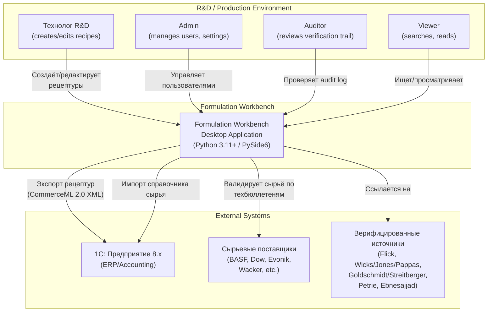
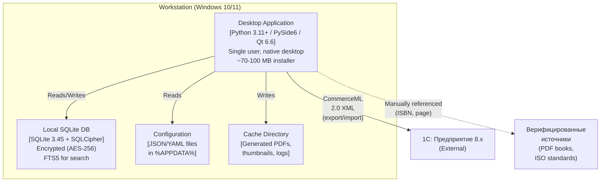
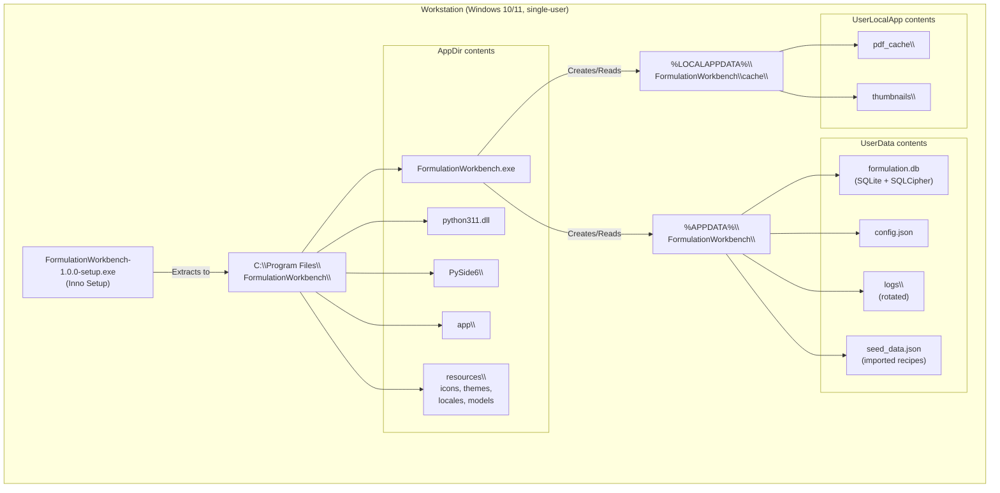

# C4 Diagrams — Formulation Workbench

**Notation:** C4 model (Context, Container, Component, Code)
**Tool:** Mermaid (text-based, renders in most markdown viewers)

---

## Level 1: System Context

Показывает, как Formulation Workbench взаимодействует с пользователями и внешними системами.



---

## Level 2: Containers

Декомпозиция Formulation Workbench на контейнеры (отдельные процессы/приложения).



---

## Level 3: Components

Декомпозиция Desktop Application на основные компоненты.

```mermaid
graph TB
    subgraph "Presentation Layer (PySide6)"
        MainWindow["MainWindow<br/>(Qt Main Window)"]
        RecipeEditor["RecipeEditor View<br/>(multi-tab form)"]
        CatalogView["CatalogView<br/>(filterable list)"]
        ComparisonView["ComparisonView<br/>(side-by-side, up to 4)"]
        CalculatorView["CalculatorView<br/>(batch scaling)"]
        PredictorView["PredictorView<br/>(properties prediction)"]
        VerificationPanel["VerificationPanel<br/>(workflow UI)"]
        CommandPalette["Command Palette<br/>(Ctrl+K fuzzy search)"]
        ThemeManager["ThemeManager<br/>(Light/Dark/HC)"]
    end

    subgraph "Application Layer (Use Cases + CQRS)"
        RecipeCommands["Recipe Commands<br/>(Create, Update,<br/>Delete, SubmitForReview,<br/>Verify)"]
        RecipeQueries["Recipe Queries<br/>(GetById, Search,<br/>Filter, Compare)"]
        VerificationService["Verification Service<br/>(triple-verification<br/>workflow)"]
        CalculatorService["Calculator Service<br/>(batch, PVC/CPVC,<br/>Tg, HSP, RoM)"]
        PredictorService["Predictor Service<br/>(rule-based +<br/>sklearn ML advisory)"]
        AuditService["Audit Service<br/>(log every change)"]
        ExportService["Export Service<br/>(PDF, XLSX, CSV,<br/>JSON, CommerceML)"]
    end

    subgraph "Domain Layer (Pure Python)"
        Recipe["Recipe Entity"]
        Component["Component Value Object"]
        Source["Source Reference<br/>Value Object"]
        Verification["Verification Status<br/>Value Object"]
        CasNumber["CAS Number<br/>Value Object"]
        MassPercent["Mass Percent<br/>Value Object"]
        DomainEvents["Domain Events"]
        DomainServices["Domain Services<br/>(ClassRanker,<br/>ValidationRules)"]
    end

    subgraph "Infrastructure Layer"
        RecipeRepo["Recipe Repository<br/>(SQLAlchemy +<br/>SQLCipher)"]
        FTSSearch["FTS5 Search Adapter"]
        PDFGen["PDF Generator<br/>(ReportLab)"]
        OneCAdapter["1С CommerceML<br/>Adapter"]
        MLPredictor["sklearn ML Predictor<br/>(advisory only)"]
        RuleEngine["Rule Engine<br/>(PVC/CPVC, Tg/Fox,<br/>HSP, RoM)"]
        Logger["Structured Logger<br/>(structlog)"]
        i18n["i18n (Babel/gettext)"]
    end

    MainWindow --> RecipeEditor
    MainWindow --> CatalogView
    MainWindow --> ComparisonView
    MainWindow --> CalculatorView
    MainWindow --> PredictorView
    MainWindow --> VerificationPanel
    MainWindow --> CommandPalette
    MainWindow --> ThemeManager

    RecipeEditor --> RecipeCommands
    CatalogView --> RecipeQueries
    ComparisonView --> RecipeQueries
    CalculatorView --> CalculatorService
    PredictorView --> PredictorService
    VerificationPanel --> VerificationService
    VerificationPanel --> AuditService

    RecipeCommands --> Recipe
    RecipeCommands --> Source
    RecipeCommands --> Verification
    RecipeCommands --> DomainEvents
    RecipeCommands --> RecipeRepo
    RecipeCommands --> AuditService
    RecipeCommands --> VerificationService

    RecipeQueries --> RecipeRepo
    RecipeQueries --> FTSSearch

    CalculatorService --> DomainServices
    CalculatorService --> RuleEngine
    PredictorService --> RuleEngine
    PredictorService --> MLPredictor

    ExportService --> PDFGen
    ExportService --> OneCAdapter
    ExportService --> RecipeRepo

    RecipeRepo --> Logger
    FTSSearch --> Logger
    PDFGen --> i18n
```



---

## Level 4: Code (пример для Recipe Entity)

```python
# domain/entities/recipe.py

class Recipe:
    """Aggregate root для рецептуры."""

    def __init__(
        self,
        id: RecipeId,
        metadata: RecipeMetadata,
        composition: CompositionStages,
        source_reference: SourceReference,
        status: VerificationStatus,
        audit_log: AuditLog,
    ):
        self._id = id
        self._metadata = metadata
        self._composition = composition
        self._source_reference = source_reference
        self._status = status
        self._audit_log = audit_log

        self._validate_invariants()

    def _validate_invariants(self) -> None:
        """Domain invariants — pure validation, no I/O."""
        self._composition.validate_mass_percent_sums_to_100()
        if self._status == VerificationStatus.VERIFIED:
            self._source_reference.assert_has_three_independent_verifications()
            self._composition.assert_all_components_have_cas_numbers()

    def submit_for_review(self, reviewer: UserId) -> ReviewSubmission:
        """Domain operation."""
        if self._status not in {VerificationStatus.DRAFT, VerificationStatus.REJECTED}:
            raise InvalidStateTransition(...)
        return ReviewSubmission(...)

    def verify(self, verifier: UserId, source_citation: Citation) -> None:
        self._status.increment_verification_count()
        if self._status.verification_count >= 3:
            self._status = VerificationStatus.VERIFIED
            self._audit_log.record_verification(...)
```

---

## Deployment View


