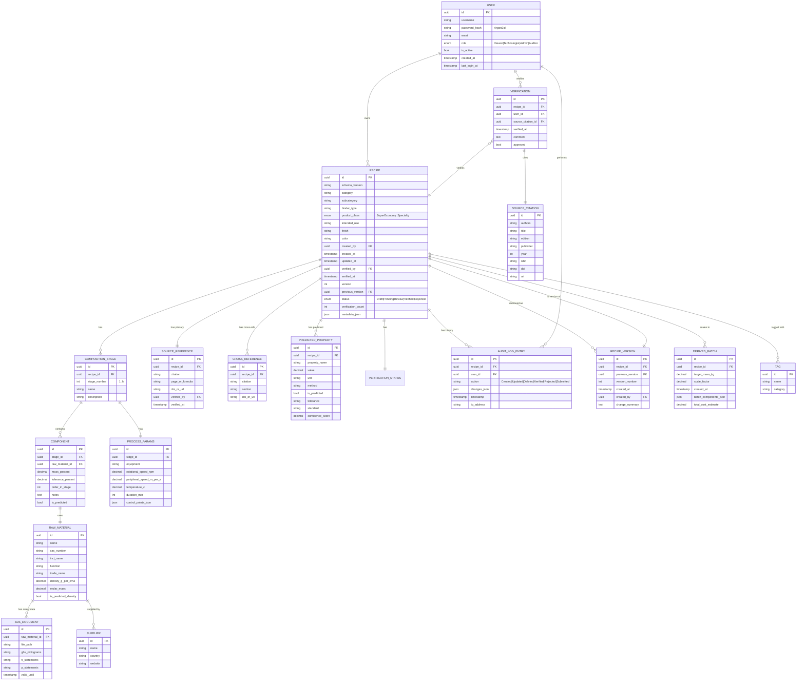

# ER Diagram — Formulation Workbench Database

**Notation:** Mermaid ER
**DB:** SQLite 3.45 + SQLCipher 4 (AES-256)

---

## Entity-Relationship Diagram



---

## Key Design Decisions

### 1. Audit Log — отдельная таблица, не триггеры
Полная история изменений для compliance. Каждое изменение пишется явно через repository. Trigger-ы — fallback.

### 2. RECIPE.VERSION — для versioned editing
Verified рецептуры — иммутабельны. Любое изменение создаёт новую запись в RECIPE_VERSION с указанием previous_version. Diff-просмотр между версиями.

### 3. SOURCE_CITATION — нормализованная таблица
Все источники хранятся в одной таблице с ISBN/DOI, чтобы избежать дублирования и обеспечить cross-referencing. PRIMARY и CROSS_REFERENCE ссылки указывают на одну и ту же запись.

### 4. RAW_MATERIAL — отдельно от COMPONENT
Сырьё может использоваться в разных рецептурах. Хранение отдельно позволяет:
- Делить SDS документы между рецептурами
- Использовать один CAS для дедупликации
- Строить справочник сырья для 1С-импорта

### 5. PREDICTED_PROPERTY — отдельно от MEASURED_PROPERTY
Расчётные и измеренные значения хранятся раздельно. В MVP v1.0 — только predicted (лабораторные измерения — backlog v2.0).

### 6. JSON-поля для гибких структур
- `metadata_json` — свободные метаданные (custom fields)
- `changes_json` — что именно изменилось в audit log
- `control_points_json` — массив контрольных точек процесса
- `batch_components_json` — рассчитанные количества для derived batch

Trade-off: гибкость vs типизация. JSON-поля валидируются через Pydantic на уровне application/domain.

---

## Indexes (для производительности)

```sql
-- FTS5 для полнотекстового поиска
CREATE VIRTUAL TABLE recipe_fts USING fts5(
    recipe_id UNINDEXED,
    category,
    subcategory,
    binder_type,
    product_class,
    intended_use,
    tags,
    source_citations,
    content='recipe',
    tokenize='unicode61 remove_diacritics 2'
);

-- Индексы для частых запросов
CREATE INDEX idx_recipe_category ON recipe(category, subcategory);
CREATE INDEX idx_recipe_class ON recipe(product_class);
CREATE INDEX idx_recipe_status ON recipe(status);
CREATE INDEX idx_recipe_verified_at ON recipe(verified_at);

CREATE INDEX idx_component_raw_material ON component(raw_material_id);
CREATE INDEX idx_audit_log_recipe ON audit_log_entry(recipe_id, timestamp DESC);
CREATE INDEX idx_audit_log_user ON audit_log_entry(user_id, timestamp DESC);

CREATE INDEX idx_source_citation_isbn ON source_citation(isbn);
CREATE INDEX idx_raw_material_cas ON raw_material(cas_number);
```

---

## DDL (SQLite + SQLCipher) — начальная миграция Alembic

Файл: `migrations/versions/0001_initial_schema.py`

```python
"""Initial schema

Revision ID: 0001
Revises:
Create Date: 2026-06-24

"""
from alembic import op
import sqlalchemy as sa

revision = '0001'
down_revision = None
branch_labels = None
depends_on = None


def upgrade() -> None:
    # === RECIPE ===
    op.create_table(
        'recipe',
        sa.Column('id', sa.String(36), primary_key=True),
        sa.Column('schema_version', sa.String(16), nullable=False),
        sa.Column('category', sa.String(64), nullable=False, index=True),
        sa.Column('subcategory', sa.String(128), nullable=False),
        sa.Column('binder_type', sa.String(128), nullable=False),
        sa.Column('product_class', sa.String(32), nullable=False, index=True),
        sa.Column('intended_use', sa.Text, nullable=False),
        sa.Column('finish', sa.String(64)),
        sa.Column('color', sa.String(64)),
        sa.Column('created_by', sa.String(36), sa.ForeignKey('user.id'), nullable=False),
        sa.Column('created_at', sa.DateTime, nullable=False),
        sa.Column('updated_at', sa.DateTime, nullable=False),
        sa.Column('verified_by', sa.String(36), sa.ForeignKey('user.id')),
        sa.Column('verified_at', sa.DateTime),
        sa.Column('version', sa.Integer, nullable=False, default=1),
        sa.Column('previous_version_id', sa.String(36), sa.ForeignKey('recipe.id')),
        sa.Column('status', sa.String(32), nullable=False, default='Draft', index=True),
        sa.Column('verification_count', sa.Integer, nullable=False, default=0),
        sa.Column('metadata_json', sa.Text),
    )

    # ... (остальные таблицы по диаграмме)
```

Полная миграция будет сгенерирована в Phase 1 автоматически через `alembic revision --autogenerate`.

---

## Encryption

Все таблицы хранятся в одном файле `formulation.db`, зашифрованном SQLCipher с AES-256. Ключ шифрования выводится из passphrase пользователя через Argon2id.

```python
# infrastructure/db/connection.py
PRAGMA key = "x'{}'";  -- hex-encoded 32-byte key derived from passphrase
PRAGMA cipher_page_size = 4096;
PRAGMA kdf_iter = 256000;
PRAGMA cipher_hmac_algorithm = HMAC_SHA512;
PRAGMA cipher_kdf_algorithm = PBKDF2_HMAC_SHA512;
```

Бэкап БД — копирование файла (с сохранением метаданных шифрования).
